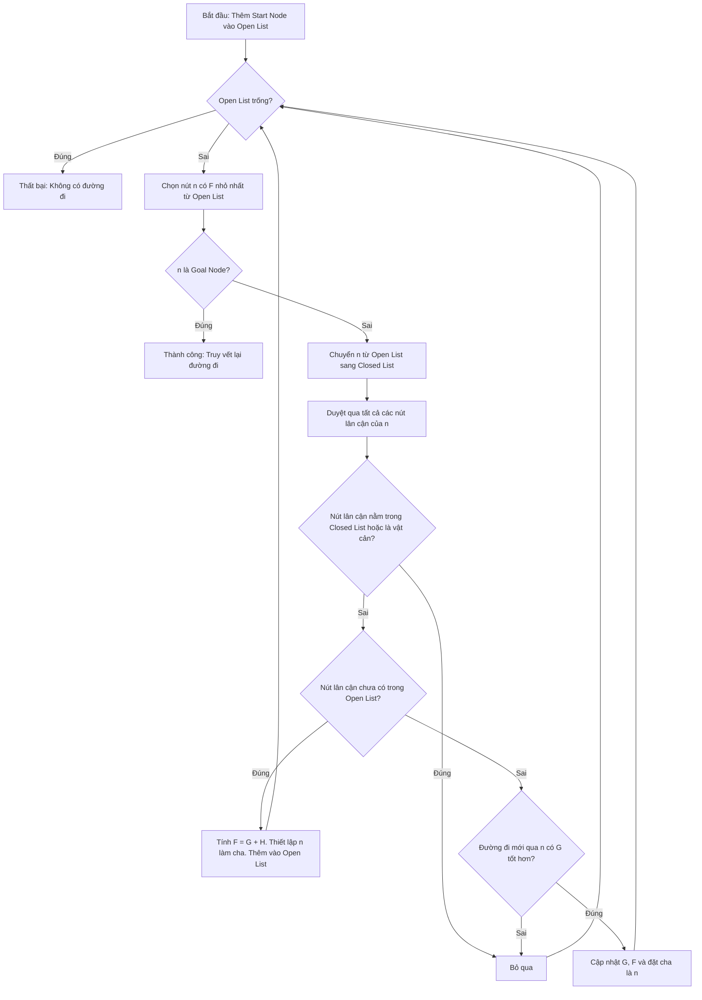

# Tài liệu Kỹ thuật: Thuật toán A* và Ứng dụng trong Mô phỏng Giải mê cung với ROS 2 / Nav2

Tài liệu này trình bày chi tiết về bản chất toán học của thuật toán tìm đường **A\*** (A-Star) và cơ chế tích hợp, vận hành của nó trong hệ thống mô phỏng robot tự hành **Turtlebot3** giải mê cung sử dụng **ROS 2, Navigation 2 (Nav2), và Gazebo**.

---

## 1. Lý thuyết cốt lõi về Thuật toán A*

Thuật toán A* là thuật toán tìm kiếm heuristic được phát triển để tìm kiếm đường đi ngắn nhất trên đồ thị một cách hiệu quả. A* tối ưu hóa hiệu năng bằng cách kết hợp ưu điểm của hai thuật toán kinh điển:
*   **Dijkstra's Algorithm:** Bảo toàn tính tối ưu (luôn tìm thấy đường đi ngắn nhất) bằng cách ưu tiên các nút có chi phí thực tế nhỏ nhất từ điểm xuất phát.
*   **Greedy Best-First Search:** Tận dụng tốc độ tìm kiếm nhanh bằng cách định hướng đi về phía đích dựa trên một hàm ước lượng (Heuristic).



### 1.1. Công thức Toán học
Tại mỗi nút $n$ trên bản đồ, A* tính toán hàm đánh giá toàn cục:

$$F(n) = G(n) + H(n)$$

Trong đó:
*   **$G(n)$ (Cost to Go):** Chi phí thực tế tích lũy từ nút xuất phát (Start) đến nút hiện tại $n$.
*   **$H(n)$ (Heuristic - Cost to Come):** Chi phí ước lượng (khoảng cách) từ nút hiện tại $n$ đến nút đích (Goal).
*   **$F(n)$ (Total Estimated Cost):** Tổng chi phí ước lượng của đường đi tối ưu đi qua nút $n$.

### 1.2. Các điều kiện biên quan trọng
Tính tối ưu của A* phụ thuộc hoàn toàn vào hàm ước lượng $H(n)$:
*   **Nếu $H(n) = 0$:** A* hoạt động chính xác như thuật toán **Dijkstra**, luôn đảm bảo tìm được đường đi ngắn nhất nhưng duyệt qua rất nhiều nút dư thừa (chậm).
*   **Nếu $H(n)$ luôn nhỏ hơn hoặc bằng chi phí thực tế ($H(n) \le H^*(n)$):** Hàm Heuristic được gọi là **Admissible (chấp nhận được)**. A* được đảm bảo sẽ tìm ra đường đi ngắn nhất tuyệt đối.
*   **Nếu $H(n)$ chiếm ưu thế cực lớn so với $G(n)$:** A* hoạt động giống **Greedy BFS**, tốc độ tìm kiếm cực nhanh nhưng đường đi có thể bị lệch, không tối ưu.

### 1.3. Lựa chọn Hàm Heuristic cho Robot tự hành
Trong hệ thống bản đồ lưới của dự án, việc chọn khoảng cách Heuristic phụ thuộc vào mô hình di chuyển:

| Hàm Heuristic | Công thức | Ngữ cảnh sử dụng trong Grid Map |
| :--- | :--- | :--- |
| **Manhattan Distance** | $D \times (|x_1 - x_2| + |y_1 - y_2|)$ | Phù hợp khi robot chỉ di chuyển 4 hướng (Lên, Xuống, Trái, Phải). |
| **Euclidean Distance** | $D \times \sqrt{(x_1 - x_2)^2 + (y_1 - y_2)^2}$ | Phù hợp nhất khi robot di chuyển liên tục, đa hướng tự do trong không gian Gazebo. |

---

## 2. Ứng dụng A* trong Dự án Mô phỏng Turtlebot3 ROS 2

Trong mã nguồn và cấu trúc hệ thống của bạn (sử dụng `BasicNavigator` trong `maze_solver.py` và lưới bản đồ từ `OccupancyGrid`), thuật toán A* không cần phải code thủ công từng dòng mà được **vận hành ở mức nhân của hệ thống thông qua bộ lập kế hoạch đường đi của Nav2**.

```
 +------------------+      Bản đồ Grid      +-------------------------+      Đường đi tối ưu
 |  Gazebo / SLAM   | --------------------> |    Nav2 Smac Planner    | ---------------------> [ maze_solver.py ]
 | (Occupancy Grid) |                       | (Thực thi giải thuật A*) |                        (BasicNavigator)
 +------------------+                       +-------------------------+
```

### 2.1. Ánh xạ từ Bản đồ Lưới (Occupancy Grid) sang Đồ thị (Graph)
File `occupancy_grid_pub.py` thể hiện cách hệ thống ROS 2 lưu trữ bản đồ dưới dạng lưới các ô vuông `OccupancyGrid`:
*   Mỗi ô vuông có giá trị: `0` (trống - di chuyển được), `100` (vật cản/tường mê cung), hoặc `-1` (chưa xác định).
*   Bộ lập kế hoạch toàn cục **Smac Planner** của Nav2 sẽ tự động chuyển đổi lưới `OccupancyGrid` này thành một đồ thị dạng lưới (Grid Graph). 
*   Các ô có giá trị `0` sẽ được coi là các nút (Nodes) hợp lệ trên đồ thị, còn các ô `100` sẽ bị A* bỏ qua (coi như vật cản vô hạn chi phí).

### 2.2. Smac Planner (Nav2) thực thi A* như thế nào?
Khi bạn gọi lệnh xác định điểm đích từ RViz (`Nav2 Goal` tương tác trực tiếp với `maze_solver.py`), hệ thống Nav2 sẽ kích hoạt **Smac Planner**:
1.  **Xác định tọa độ:** Chuyển đổi tọa độ xuất phát (Initial Pose - đã sửa lỗi Quaternion trong code của bạn thành góc $0^\circ$ chuẩn: $z=0.0, w=1.0$) và tọa độ đích (Goal Pose) về dạng chỉ số ô lưới (Grid Indices).
2.  **Tính toán chi phí di chuyển (G-value):** Chi phí đi từ ô này sang ô lân cận không chỉ là khoảng cách vật lý (ví dụ: $1.0$ cho ô thẳng hàng, $1.414$ cho ô chéo) mà còn cộng thêm chi phí **Inflation Layer** (Lớp phình chướng ngại vật). Nếu robot đi quá gần tường mê cung, chi phí $G(n)$ sẽ tăng vọt nhằm hướng robot đi giữa hành lang mê cung để tránh va chạm.
3.  **Tính toán Heuristic (H-value):** Smac Planner sử dụng thuật toán tính khoảng cách Euclidean/Manhattan cải tiến để ước lượng khoảng cách từ robot đến lối thoát mê cung.
4.  **Tạo quỹ đạo:** Chạy vòng lặp A* để tìm ra dãy các ô có $F(n)$ nhỏ nhất nối từ điểm xuất phát đến đích, sau đó làm mịn (smooth) để tạo thành một đường đi liên tục cho Turtlebot3 di chuyển.

### 2.3. Quy trình thực thi thực tế trong mã nguồn của bạn
Nhìn vào file `maze_solver.py` của bạn, quy trình hoạt động của hệ thống diễn ra như sau:

```python
# 1. Khởi tạo Navigator kết nối tới Nav2 Stack
navigator = BasicNavigator()

# 2. Định cấu hình điểm khởi hành (Initial Pose) cho AMCL để khoanh vùng vị trí robot trên bản đồ mê cung
navigator.setInitialPose(initial_pose)

# 3. Đợi hệ thống Nav2 nạp xong bản đồ mê cung (OccupancyGrid) từ SLAM/Gazebo và dựng đồ thị A*
navigator.waitUntilNav2Active()

# 4. Khi bạn Click nút 'Nav2 Goal' trên RViz:
#    - Tọa độ đích được gửi qua Topic '/goal_pose' tới Nav2.
#    - Nav2 Smac Planner thực thi thuật toán A* trên bản đồ lưới.
#    - Trích xuất ra đường đi tối ưu (Global Path) tránh hoàn toàn tường mê cung tĩnh.
#    - Bộ điều khiển cục bộ (Local Planner) điều khiển động cơ DYNAMIXEL của Turtlebot3 bám theo đường đi này.
```

---

## 3. Cấu hình tham số A* tối ưu cho Mê cung trong Nav2

Để A* giải mê cung nhanh nhất và mượt nhất, các tham số trong file cấu hình YAML của Nav2 (`nav2_params.yaml`) thường được tinh chỉnh như sau:

```yaml
planner_server:
  ros__parameters:
    expected_planner_frequency: 20.0
    planner_plugins: ["GridTransition"]
    GridTransition:
      plugin: "nav2_smac_planner/SmacPlanner2D" # Sử dụng Smac Planner 2D dựa trên A*
      tolerance: 0.12                           # Dung sai khoảng cách đích (m)
      downsample_costmap: false                 # Giữ nguyên độ phân giải bản đồ để vẽ đường đi chính xác
      allow_unknown: false                      # Không cho phép đi qua vùng chưa quét (-1)
      max_iterations: 1000000                   # Giới hạn số bước lặp tối đa của A* đề phòng mê cung khép kín
      heuristic_scale: 1.0                      # Hệ số H(n). Giữ = 1.0 để đảm bảo A* tối ưu tuyệt đối.
```

## 4. Tóm tắt ưu thế của A* trong Đồ án
*   **Đảm bảo an toàn:** Nhờ kết hợp bản đồ lưới `OccupancyGrid` và hàm chi phí $G(n)$ có tính toán đến kích thước robot (Inflation), thuật toán A* luôn tìm ra đường đi có khoảng cách an toàn với tường mê cung.
*   **Tối ưu quãng đường:** Khác với các thuật toán dò đường heuristic đơn giản (như bám tường - Wall Follower), A* luôn tìm ra **đường đi ngắn nhất tuyệt đối** từ điểm bất kỳ trong mê cung đến lối ra.
*   **Hiệu năng vượt trội:** Phù hợp với cấu hình máy tính nhúng thực tế (như Raspberry Pi 4) nhờ cắt giảm tối đa các vùng tìm kiếm không khả thi bằng hàm Heuristic định hướng thông minh.
