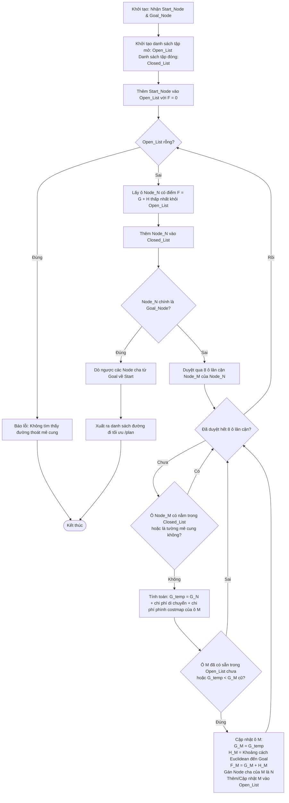

# Tài liệu Kỹ thuật: Thuật toán A* và Ứng dụng trong Mô phỏng Giải mê cung với ROS 2 / Nav2

Tài liệu này trình bày chi tiết về bản chất toán học của thuật toán tìm đường **A\*** (A-Star) và cơ chế tích hợp, vận hành của nó trong hệ thống mô phỏng robot tự hành **Turtlebot3** giải mê cung sử dụng **ROS 2, Navigation 2 (Nav2), và Gazebo**.

---

## 1. Lý thuyết cốt lõi về Thuật toán A*

Thuật toán A* là thuật toán tìm kiếm heuristic được phát triển để tìm kiếm đường đi ngắn nhất trên đồ thị một cách hiệu quả. A* tối ưu hóa hiệu năng bằng cách kết hợp ưu điểm của hai thuật toán kinh điển:
*   **Dijkstra's Algorithm:** Bảo toàn tính tối ưu (luôn tìm thấy đường đi ngắn nhất) bằng cách ưu tiên các nút có chi phí thực tế nhỏ nhất từ điểm xuất phát.
*   **Greedy Best-First Search:** Tận dụng tốc độ tìm kiếm nhanh bằng cách định hướng đi về phía đích dựa trên một hàm ước lượng (Heuristic).



### 1.1. Công thức Toán học
Tại mỗi nút $n$ trên bản đồ, A* tính toán hàm đánh giá toàn cục:

$$F(n) = G(n) + H(n)$$

Trong đó:
*   **$G(n)$ (Cost to Come):** Chi phí thực tế tích lũy từ nút xuất phát (Start) đến nút hiện tại $n$.
*   **$H(n)$ (Heuristic - Cost to Go):** Chi phí ước lượng (khoảng cách) từ nút hiện tại $n$ đến nút đích (Goal).
*   **$F(n)$ (Total Estimated Cost):** Tổng chi phí ước lượng của đường đi tối ưu đi qua nút $n$.

### 1.2. Các điều kiện biên quan trọng
Tính tối ưu của A* phụ thuộc hoàn toàn vào hàm ước lượng $H(n)$ (Heuristic):
*   **Nếu $H(n) = 0$:** A* hoạt động chính xác như thuật toán **Dijkstra**, luôn đảm bảo tìm được đường đi ngắn nhất nhưng duyệt qua rất nhiều nút dư thừa (chậm).
*   **Nếu $H(n)$ luôn nhỏ hơn hoặc bằng chi phí thực tế ($H(n) \le H^*(n)$):** Hàm Heuristic được gọi là **Admissible (chấp nhận được)**. A* được đảm bảo sẽ tìm ra đường đi ngắn nhất tuyệt đối.
*   **Nếu $H(n)$ chiếm ưu thế cực lớn so với $G(n)$:** A* hoạt động giống **Greedy BFS**, tốc độ tìm kiếm cực nhanh nhưng đường đi có thể bị lệch, không tối ưu.

### 1.3. Lựa chọn Hàm Heuristic cho Robot tự hành
Trong hệ thống bản đồ lưới của dự án, việc chọn khoảng cách Heuristic phụ thuộc vào mô hình di chuyển:

| Hàm Heuristic | Công thức | Ngữ cảnh sử dụng trong Grid Map |
| :--- | :--- | :--- |
| **Manhattan Distance** | $D \times (|x_1 - x_2| + |y_1 - y_2|)$ | Phù hợp khi robot chỉ di chuyển 4 hướng (Lên, Xuống, Trái, Phải). |
| **Euclidean Distance** | $D \times \sqrt{(x_1 - x_2)^2 + (y_1 - y_2)^2}$ | Phù hợp nhất khi robot di chuyển liên tục, đa hướng tự do trong không gian Gazebo. |

---

## 2. Ứng dụng A* trong Dự án Mô phỏng Turtlebot3 ROS 2

Trong mã nguồn và cấu trúc hệ thống của bạn (sử dụng `BasicNavigator` trong `maze_solver.py` và lưới bản đồ từ `OccupancyGrid`), thuật toán A* không cần phải code thủ công từng dòng mà được **vận hành ở mức nhân của hệ thống thông qua bộ lập kế hoạch đường đi của Nav2**.

```
 +------------------+      Bản đồ Grid      +-------------------------+      Đường đi tối ưu
 |  Gazebo / SLAM   | --------------------> |    Nav2 NavfnPlanner    | ---------------------> [ maze_solver.py ]
 | (Occupancy Grid) |                       | (Thực thi giải thuật A*) |                        (BasicNavigator)
 +------------------+                       +-------------------------+
```

### 2.1. Ánh xạ từ Bản đồ Lưới (Occupancy Grid) sang Đồ thị (Graph)
Các node bản đồ hoặc SLAM thể hiện cách hệ thống ROS 2 lưu trữ bản đồ dưới dạng lưới các ô vuông `OccupancyGrid`:
*   Mỗi ô vuông có giá trị: `0` (trống - di chuyển được), `100` (chắc chắn có vật cản/tường mê cung), hoặc `-1` (chưa xác định).
*   *(Lưu ý: File node học tập `occupancy_grid_pub.py` sử dụng giá trị `1` cho vật cản để biểu thị đơn giản, trong khi lưới bản đồ chuẩn từ SLAM/Map Server chạy trên Gazebo sử dụng thang điểm chuẩn `0` đến `100`)*.
*   Bộ lập kế hoạch toàn cục **NavfnPlanner** của Nav2 sẽ tự động chuyển đổi lưới `OccupancyGrid` này thành một đồ thị dạng lưới (Grid Graph). 
*   Các ô trống (giá trị `0`) sẽ được coi là các nút (Nodes) hợp lệ trên đồ thị, còn các ô vật cản sẽ bị bỏ qua hoặc tính chi phí cực lớn.

### 2.2. NavfnPlanner (Nav2) thực thi A* như thế nào?
Khi bạn gọi lệnh xác định điểm đích từ RViz (`Nav2 Goal` tương tác trực tiếp với `maze_solver.py`), hệ thống Nav2 sẽ kích hoạt **NavfnPlanner**:
1.  **Xác định tọa độ:** Chuyển đổi tọa độ xuất phát (Initial Pose - đã sửa lỗi Quaternion trong code của bạn thành góc $0^\circ$ chuẩn: $z=0.0, w=1.0$) và tọa độ đích (Goal Pose) về dạng chỉ số ô lưới (Grid Indices).
2.  **Tính toán chi phí di chuyển (G-value):** Chi phí đi từ ô này sang ô lân cận không chỉ là khoảng cách vật lý (ví dụ: $1.0$ cho ô thẳng hàng, $1.414$ cho ô chéo) mà còn cộng thêm chi phí **Inflation Layer** (Lớp phình chướng ngại vật). Nếu robot đi quá gần tường mê cung, chi phí $G(n)$ sẽ tăng vọt nhằm hướng robot đi giữa hành lang mê cung để tránh va chạm.
3.  **Tính toán Heuristic (H-value):** NavfnPlanner sử dụng khoảng cách Euclidean để ước lượng khoảng cách từ ô hiện tại đến lối thoát mê cung. Thuật toán A* được bật rõ ràng thông qua tham số cấu hình `use_astar: true`.
4.  **Tạo quỹ đạo:** Chạy vòng lặp A* để tìm ra dãy các ô có $F(n)$ nhỏ nhất nối từ điểm xuất phát đến đích, sau đó tạo thành một đường đi liên tục cho Turtlebot3 di chuyển.

### 2.3. Quy trình thực thi thực tế trong mã nguồn của bạn
Nhìn vào file `maze_solver.py` của bạn, quy trình hoạt động của hệ thống được tổ chức hướng đối tượng một cách chuyên nghiệp như sau:

```python
# 1. Định nghĩa cấu hình xuất phát xuất phát dưới dạng dataclass
@dataclass(frozen=True)
class InitialPose:
    x: float
    y: float
    yaw_z: float = 0.0
    yaw_w: float = 1.0

# 2. Lớp điều khiển chính MazeSolver tích hợp BasicNavigator của Nav2
class MazeSolver:
    def __init__(self, navigator: BasicNavigator, initial_pose: InitialPose) -> None:
        self.navigator = navigator
        self.initial_pose = initial_pose

    def configure_initial_pose(self) -> None:
        # Nạp điểm xuất phát để khoanh vùng vị trí robot trên bản đồ mê cung
        self.navigator.setInitialPose(build_pose_stamped(self.initial_pose))

    def wait_until_ready(self) -> None:
        # Đợi hệ thống Nav2 nạp xong bản đồ và sẵn sàng hoạt động
        self.navigator.waitUntilNav2Active()

    def run(self) -> None:
        self.configure_initial_pose()
        self.wait_until_ready()
        self.print_ready_message()

# 3. Khi gọi MazeSolver(...).run():
#    - Điểm xuất phát (DEFAULT_INITIAL_POSE) được thiết lập.
#    - Đợi toàn bộ hệ thống Nav2 Stack (amcl, planner_server, controller_server...) hoạt động.
#    - Khi bạn Click nút 'Nav2 Goal' trên RViz:
#        + Tọa độ đích được gửi đến Nav2.
#        + Nav2 NavfnPlanner thực thi thuật toán A* tìm đường đi tối ưu (Global Path) tránh vật cản.
#        + Bộ điều khiển cục bộ (DWB Local Planner) điều khiển động cơ DYNAMIXEL của Turtlebot3 di chuyển bám đường.
```

---

## 3. Cấu hình tham số A* trong Dự án (`tb3_nav_params.yaml`)

Để thuật toán A* chạy chuẩn xác trên bản đồ lưới của mê cung trong dự án của bạn, bộ lập kế hoạch toàn cục (`planner_server`) được cấu hình chi tiết như sau:

```yaml
planner_server:
  ros__parameters:
    expected_planner_frequency: 5.0             # Tần số tính toán lại đường đi (Hz)
    use_sim_time: True                          # Sử dụng thời gian mô phỏng từ Gazebo
    planner_plugins: ["GridBased"]              # Plugin lập kế hoạch được sử dụng
    GridBased:
      plugin: "nav2_navfn_planner/NavfnPlanner" # Bộ lập kế hoạch NavfnPlanner chuẩn của Nav2
      tolerance: 0.5                            # Dung sai khoảng cách đích chấp nhận được (mét)
      use_astar: true                           # BẮT BUỘC: Đặt thành true để sử dụng thuật toán A* (thay vì Dijkstra)
      allow_unknown: true                       # Cho phép lập kế hoạch đi qua các vùng chưa quét quét (-1)
```

### Ý nghĩa của các tham số chính đối với giải thuật:
*   **`use_astar: true`**: Tham số quyết định chuyển đổi thuật toán tìm kiếm từ Dijkstra truyền thống sang **A*** để tối ưu tốc độ tính toán nhờ sự hỗ trợ của hàm Heuristic.
*   **`tolerance: 0.5`**: Nếu điểm đích rơi vào vật cản hoặc vùng không thể tới gần sát nút, thuật toán sẽ cố gắng tìm ô trống khả thi gần đích nhất trong phạm vi bán kính `0.5m`.
*   **`expected_planner_frequency: 5.0`**: Lập kế hoạch đường đi toàn cục sau mỗi `0.2` giây giúp cập nhật đường đi nhanh chóng khi có sự thay đổi.

---


## 4. Tóm tắt ưu thế của A* trong Đồ án
*   **Đảm bảo an toàn:** Nhờ kết hợp bản đồ lưới `OccupancyGrid` và hàm chi phí $G(n)$ có tính toán đến kích thước robot (Inflation Layer với `inflation_radius: 0.55`), thuật toán A* luôn tìm ra đường đi có khoảng cách an toàn, tránh va chạm với tường mê cung.
*   **Tối ưu quãng đường:** Khác với các thuật toán dò đường heuristic đơn giản (như bám tường - Wall Follower), A* luôn tìm ra **đường đi ngắn nhất tuyệt đối** từ điểm bất kỳ trong mê cung đến lối ra.
*   **Hiệu năng vượt trội:** Phù hợp với cấu hình máy tính nhúng thực tế nhờ cắt giảm tối đa các vùng tìm kiếm không khả thi bằng hàm Heuristic định hướng thông minh.

