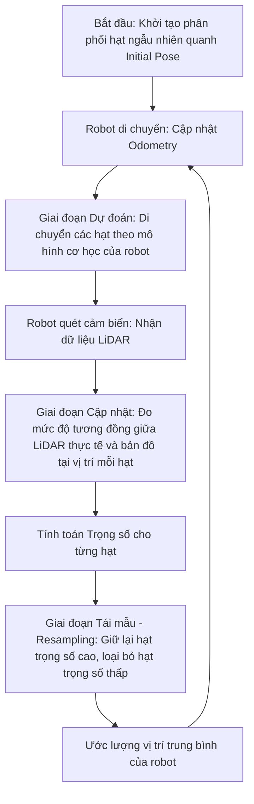

# Tài liệu Kỹ thuật: Định vị AMCL (Adaptive Monte Carlo Localization) trong ROS 2

Tài liệu này trình bày chi tiết về thuật toán định vị thích nghi **AMCL** (Adaptive Monte Carlo Localization) và cơ chế tích hợp của nó trong hệ thống mô phỏng robot **Turtlebot3** giải mê cung.

---

## 1. Lý thuyết cốt lõi về Thuật toán AMCL

AMCL là thuật toán định vị dạng xác suất dành cho robot di chuyển trong không gian 2D. Thuật toán này sử dụng **Bộ lọc hạt (Particle Filter)** để theo dõi và ước lượng tư thế (pose - bao gồm tọa độ $x, y$ và góc quay $\theta$) của robot dựa trên bản đồ tĩnh đã biết trước (`OccupancyGrid`).



### 1.1. Bản chất của Bộ lọc Hạt (Particle Filter)
Thuật toán biểu diễn sự phân bố xác suất vị trí của robot bằng một tập hợp các hạt $S = \{s_i, w_i\}_{i=1..M}$:
*   **Mỗi hạt $s_i = (x, y, \theta)$:** Đại diện cho một giả thuyết về vị trí của robot trên bản đồ.
*   **Trọng số $w_i$:** Thể hiện độ tin cậy của giả thuyết đó. Trọng số càng cao nghĩa là dữ liệu quét từ vị trí của hạt đó càng khớp với bản đồ thực tế.

### 1.2. Ba bước vận hành chính của AMCL
1.  **Dự đoán (Prediction Step - Dựa trên Odometry):** Khi robot di chuyển, các hạt được dịch chuyển theo mô hình động học vi sai của Turtlebot3 cộng thêm nhiễu hệ thống (noise).
2.  **Cập nhật trọng số (Correction Step - Dựa trên LiDAR):** So sánh dữ liệu quét LiDAR (`/scan`) thực tế với bản đồ tĩnh của mê cung tại vị trí của từng hạt:
    
    $$w_i \propto P(\text{Scan} \mid s_i, \text{Map})$$
    
    Các hạt có góc quét trùng khớp với tường mê cung sẽ nhận được trọng số cực cao.
3.  **Tái mẫu (Resampling Step):** Thuật toán loại bỏ các hạt ở vị trí không khả thi (trọng số thấp) và nhân bản các hạt ở vùng chính xác (trọng số cao). **Tính thích nghi (Adaptive - KLD Sampling)** giúp tự động giảm số lượng hạt khi robot đã định vị chính xác để tiết kiệm tài nguyên CPU.

---

## 2. Ứng dụng AMCL trong Dự án Turtlebot3

Trong dự án giải mê cung, AMCL là cầu nối định vị giúp giải thuật **A\*** hoạt động chính xác.

```
                  +--------------------------------+
                  |  Điểm xuất phát (Initial Pose)  |
                  +--------------------------------+
                                  |
                                  v
 +-------------+            +-----------+            +------------------+
 | LiDAR /scan | ---------> |   AMCL    | ---------> |  A* Global Path  |
 +-------------+            | (Định vị) |            +------------------+
                                +-------+
                                  ^
                                  |
                            +-----------+
                            | Odometry  |
                            +-----------+
```

### 2.1. Thiết lập điểm xuất phát trong `maze_solver.py`
Trong file code điều khiển robot giải mê cung `maze_solver.py` của bạn, AMCL nhận thông tin khởi tạo thông qua hàm:

```python
# Thiết lập điểm xuất phát mặc định trên bản đồ
navigator.setInitialPose(initial_pose)
```

**Cơ chế hoạt động:**
*   Khi chạy lệnh này, một thông điệp `PoseStamped` chứa tọa độ chính xác của robot trong Gazebo (ví dụ: $x = -3.91, y = -7.87$) được gửi tới topic `/initialpose`.
*   Thuật toán AMCL lập tức hội tụ hàng ngàn hạt phân tán tập trung xung quanh tọa độ này.
*   Khi bạn sửa lỗi Quaternion từ dạng sai toán học sang dạng chuẩn ($z=0.0, w=1.0$), bạn giúp AMCL xác định chính xác góc hướng đầu xe ban đầu, tránh việc các hạt bị phân tán hỗn loạn dẫn đến lỗi định vị.

### 2.2. Đầu vào và Đầu ra của AMCL trong Hệ thống
*   **Đầu vào (Subscribed Topics):**
    *   `/scan` (`sensor_msgs/msg/LaserScan`): Dữ liệu khoảng cách thời gian thực từ cảm biến **LiDAR LDS-02**.
    *   `/map` (`nav_msgs/msg/OccupancyGrid`): Bản đồ lưới tĩnh của mê cung.
    *   `tf` (`tf2_msgs/msg/TFMessage`): Hệ quy chiếu liên kết giữa bánh xe và khung robot (`odom -> base_footprint`).
*   **Đầu ra (Published Topics):**
    *   `/amcl_pose` (`geometry_msgs/msg/PoseWithCovarianceStamped`): Tọa độ ước lượng kèm theo ma trận hiệp phương sai sai số của robot.
    *   `/particlecloud` (`geometry_msgs/msg/PoseArray`): Danh sách tọa độ của toàn bộ các hạt phục vụ hiển thị trực quan trên **RViz**.

---

## 3. Cấu hình Tham số AMCL Tối ưu cho Mê cung (`tb3_nav_params.yaml`)

Trong môi trường mê cung hẹp, việc tối ưu hóa các tham số lọc hạt thích nghi (Adaptive Particle Filter) giúp cân bằng giữa độ chính xác định vị và hiệu năng CPU:

```yaml
amcl:
  ros__parameters:
    min_particles: 500          # Số lượng hạt tối thiểu để duy trì định vị ổn định
    max_particles: 2000         # Số lượng hạt tối đa khi mất định vị (phục vụ tái quét toàn cục)
    pf_err: 0.05                # Sai số bộ lọc hạt mong muốn
    pf_z: 0.99                  # Độ tin cậy KLD
    update_min_d: 0.25          # Cập nhật hạt khi robot di chuyển tịnh tiến tối thiểu 25cm
    update_min_a: 0.2           # Cập nhật hạt khi robot quay tối thiểu 0.2 rad (~11.4 độ)
    resample_interval: 1        # Tần suất tái mẫu hạt (mỗi bước lọc đều thực hiện tái mẫu)
    laser_max_range: 100.0      # Giới hạn quét tối đa của cảm biến trong môi trường mô phỏng (mét)
    robot_model_type: "nav2_amcl::DifferentialMotionModel" # Mô hình động lực học vi sai của Turtlebot3 Waffle
```

---

## 4. Tóm tắt Vai trò của AMCL trong Đồ án
*   **Độ chính xác cao:** Phối hợp nhịp nhàng giữa dữ liệu tích phân liên tục `/odom` (IMU & Wheel Encoders) và dữ liệu đo khoảng cách tuyệt đối `/scan` từ LiDAR để đưa ra tọa độ định vị tối ưu, giúp giải thuật **A\*** vẽ đường chuẩn xác.
*   **Tiết kiệm tài nguyên nhúng**: Nhờ cấu hình thông minh của `update_min_d: 0.25` và `update_min_a: 0.2`, robot chỉ tính toán lọc hạt khi di chuyển thực tế qua một khoảng biên độ nhất định, giảm tải tối đa CPU cho máy tính điều khiển.
*   **Tính thích nghi cao:** Có khả năng phục hồi định vị toàn cục (Global Localization) nếu robot gặp hiện tượng trượt bánh lớn trong Gazebo hoặc bị tác động dịch chuyển bất ngờ.

