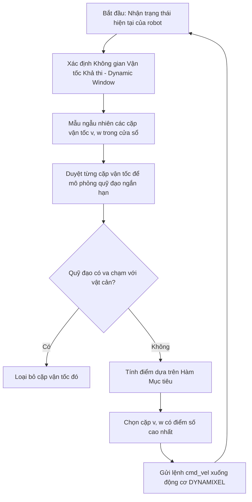

# Tài liệu Kỹ thuật: Bộ điều khiển cục bộ DWA (Dynamic Window Approach) trong ROS 2

Tài liệu này trình bày chi tiết về thuật toán điều khiển động học **DWA** (Dynamic Window Approach) và cơ chế tích hợp của nó trong hệ thống mô phỏng robot **Turtlebot3** để bám đường đi tối ưu và tránh vật cản thời gian thực.

--- 

## 1. Lý thuyết cốt lõi về Thuật toán DWA

DWA là giải pháp lập kế hoạch quỹ đạo cục bộ (Local Path Planner) dựa trên vận tốc thời gian thực dành cho robot di động có ràng buộc động học (giới hạn tốc độ, gia tốc). 

### 1.1. Ý tưởng cốt lõi
Thay vì tìm đường đi trên không gian tọa độ hình học ($x,y$), DWA trực tiếp tìm kiếm trên **không gian vận tốc** $(v, \omega)$ gồm vận tốc dài và vận tốc góc để tạo ra các quỹ đạo di chuyển khả thi, an toàn và mượt mà cho động cơ.



### 1.2. Ba bước tính toán của DWA
#### Bước 1: Thiết lập cửa sổ động (Dynamic Window Space)
Không gian vận tốc tìm kiếm $V_r$ được giới hạn bởi ba yếu tố:
1.  **Giới hạn phần cứng ($V_s$):** Vận tốc tối đa của động cơ DYNAMIXEL XM430/XL430.
2.  **Khoảng cách chướng ngại vật ($V_a$):** Vận tốc tối đa cho phép để robot kịp dừng lại trước khi đâm vào tường mê cung.
3.  **Giới hạn gia tốc ($V_d$):** Dựa trên khả năng tăng/giảm tốc của động cơ trong một chu kỳ điều khiển $\Delta t$:

$$V_d = \{(v, \omega) \mid v \in [v_c - \dot{v}\Delta t, v_c + \dot{v}\Delta t] \wedge \omega \in [\omega_c - \dot{\omega}\Delta t, \omega_c + \dot{\omega}\Delta t]\}$$

#### Bước 2: Giả lập quỹ đạo di chuyển (Trajectory Simulation)
Với mỗi cặp vận tốc $(v, \omega)$ được chọn mẫu trong cửa sổ $V_r = V_s \cap V_a \cap V_d$, thuật toán mô phỏng quỹ đạo chuyển động hình học của robot trong một khoảng thời gian ngắn tiếp theo (Simulation Time).

#### Bước 3: Đánh giá bằng Hàm mục tiêu (Objective Function Optimization)
Mỗi quỹ đạo mô phỏng được chấm điểm dựa trên hàm mục tiêu tối ưu hóa đa mục tiêu:

$$G(v, \omega) = \alpha \cdot \text{Heading}(v, \omega) + \beta \cdot \text{Dist}(v, \omega) + \gamma \cdot \text{Velocity}(v, \omega)$$

Trong đó:
*   **$\text{Heading}(v, \omega)$:** Đo độ lệch hướng giữa đầu xe robot và đường đi đích do **A\*** vạch ra. Điểm càng cao khi robot càng hướng về phía đường đi toàn cục.
*   **$\text{Dist}(v, \omega)$:** Khoảng cách từ quỹ đạo mô phỏng tới chướng ngại vật gần nhất (tường mê cung). Điểm càng cao khi robot càng cách xa tường (đảm bảo an toàn).
*   **$\text{Velocity}(v, \omega)$:** Tốc độ di chuyển. Điểm càng cao khi tốc độ càng nhanh để tối ưu thời gian thoát mê cung.

---

## 2. Ứng dụng DWA trong Dự án Turtlebot3

DWA hoạt động ở lớp dưới cùng của hệ thống điều hướng Nav2 (Controller Server), trực tiếp chuyển đổi các quyết định hình học thành chuyển động vật lý trong Gazebo.

```
 +---------------------------------------+
 |  A* Global Path (Đường đi mê cung)    |
 +---------------------------------------+
                     |
                     v
 +---------------------------------------+
 |        DWA Local Planner              | <--- Bản đồ cục bộ (Local Costmap) + LiDAR
 | (Chọn cặp v, w tối ưu từ cửa sổ động) |
 +---------------------------------------+
                     |
                     v
 +---------------------------------------+
 |    Vận tốc điều khiển /cmd_vel        |
 +---------------------------------------+
                     |
                     v
 +---------------------------------------+
 | Động cơ DYNAMIXEL (Mô phỏng Gazebo)   |
 +---------------------------------------+
```

### 2.1. Mối liên hệ với mã nguồn `maze_solver.py`
Trong file `maze_solver.py`, sau khi bạn chọn điểm đích từ RViz thông qua hệ thống Nav2:
*   Thuật toán A* dựng đường đi tổng thể (Global Path).
*   **DWA Planner** được kích hoạt liên tục (thường ở tần số 20Hz). Nó đọc dữ liệu `/scan` từ LiDAR LDS-02 để cập nhật bản đồ cục bộ (Local Costmap).
*   DWA liên tục tính toán cặp $(v, \omega)$ tốt nhất và xuất ra Topic `/cmd_vel` (`geometry_msgs/msg/Twist`) chứa:
    *   `linear.x`: Vận tốc tịnh tiến thẳng của robot.
    *   `angular.z`: Vận tốc quay vòng của robot.
*   Trình mô phỏng Gazebo nhận giá trị `/cmd_vel` này để quay 2 bánh xe của Turtlebot3 ảo, giúp robot di chuyển mượt mà bám theo mê cung.

---

## 3. Cấu hình tham số DWA Tối ưu cho Mê cung (`nav2_params.yaml`)

Trong môi trường mê cung hẹp, việc tối ưu hóa tham số gia tốc và hệ số trọng số giúp robot di chuyển linh hoạt, không bị kẹt ở góc khuất:

```yaml
FollowPath:
  plugin: "dwb_core::DWBLocalPlanner"   # Phiên bản nâng cấp chuẩn công nghiệp của DWA trong ROS 2
  max_vel_x: 0.22                       # Tốc độ dài tối đa của Turtlebot3 Burger (m/s)
  min_vel_x: -0.22                      # Cho phép lùi xe nếu đi vào ngõ cụt mê cung
  max_vel_theta: 2.84                   # Vận tốc góc tối đa (rad/s)
  acc_lim_x: 2.5                        # Giới hạn gia tốc dài (m/s^2)
  acc_lim_theta: 3.2                    # Giới hạn gia tốc góc (rad/s^2)
  sim_time: 1.7                         # Thời gian giả lập quỹ đạo (s) - Quá ngắn robot sẽ giật cục, quá dài robot phản ứng chậm
  xy_goal_tolerance: 0.1                # Sai số khoảng cách đích cho phép (10cm)
  yaw_goal_tolerance: 0.08              # Sai số góc quay hướng đích cho phép (khoảng 5 độ)
  
  # Trọng số hàm mục tiêu
  path_distance_bias: 32.0              # Ưu tiên cao việc bám sát đường đi của A*
  goal_distance_bias: 20.0              # Ưu tiên di chuyển hướng về đích
  occdist_scale: 0.02                   # Hệ số tránh xa tường mê cung
```

---

## 4. Tóm tắt Vai trò của DWA trong Đồ án
*   **Động học thực tế:** Giúp chuyển động mô phỏng của Turtlebot3 trong Gazebo hoàn toàn tuân thủ các định luật vật lý (không bị tăng tốc đột ngột, cua góc mượt mà).
*   **Né tránh chướng ngại vật động:** Mặc dù phạm vi nghiên cứu là mê cung tĩnh, nếu có vật cản đột xuất xuất hiện cắt ngang, DWA sẽ lập tức chọn quỹ đạo tránh an toàn dựa trên dữ liệu quét LiDAR thời gian thực mà không cần A* phải lập lại toàn bộ lộ trình dài.
