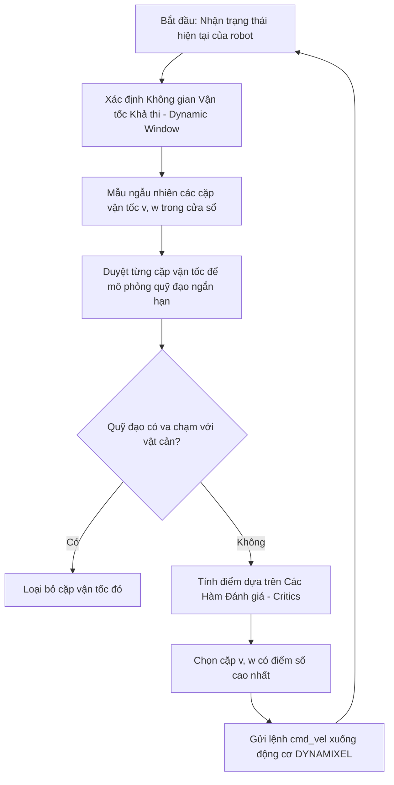

# Tài liệu Kỹ thuật: Bộ điều khiển cục bộ DWB (phiên bản ROS 2 của DWA) trong ROS 2

Tài liệu này trình bày chi tiết về thuật toán điều khiển động học cục bộ **DWB** (DWB Local Planner - phiên bản kế thừa và nâng cấp của Dynamic Window Approach trong ROS 2) và cơ chế tích hợp của nó trong hệ thống mô phỏng robot **Turtlebot3** (mô hình **Waffle**) để bám đường đi tối ưu và tránh vật cản thời gian thực.

--- 

## 1. Lý thuyết cốt lõi về Thuật toán DWA / DWB

DWA là giải pháp lập kế hoạch quỹ đạo cục bộ (Local Path Planner) dựa trên vận tốc thời gian thực dành cho robot di động có ràng buộc động học (giới hạn tốc độ, gia tốc). Trong hệ thống ROS 2 / Nav2, nó được hiện thực hóa và tối ưu bằng **DWB Local Planner**.

### 1.1. Ý tưởng cốt lõi
Thay vì tìm đường đi trên không gian tọa độ hình học ($x,y$), thuật toán trực tiếp tìm kiếm trên **không gian vận tốc** $(v, \omega)$ gồm vận tốc dài và vận tốc góc để tạo ra các quỹ đạo di chuyển khả thi, an toàn và mượt mà cho động cơ.



### 1.2. Ba bước tính toán của DWA
#### Bước 1: Thiết lập cửa sổ động (Dynamic Window Space)
Không gian vận tốc tìm kiếm $V_r$ được giới hạn bởi ba yếu tố:
1.  **Giới hạn phần cứng ($V_s$):** Vận tốc tối đa của động cơ DYNAMIXEL (XM430/XL430) trang bị trên Waffle.
2.  **Khoảng cách chướng ngại vật ($V_a$):** Vận tốc tối đa cho phép để robot kịp dừng lại an toàn trước khi đâm vào tường mê cung.
3.  **Giới hạn gia tốc ($V_d$):** Dựa trên khả năng tăng/giảm tốc của động cơ trong một chu kỳ điều khiển $\Delta t$:

$$V_d = \{(v, \omega) \mid v \in [v_c - \dot{v}\Delta t, v_c + \dot{v}\Delta t] \wedge \omega \in [\omega_c - \dot{\omega}\Delta t, \omega_c + \dot{\omega}\Delta t]\}$$

#### Bước 2: Giả lập quỹ đạo di chuyển (Trajectory Simulation)
Với mỗi cặp vận tốc $(v, \omega)$ được chọn mẫu trong cửa sổ $V_r = V_s \cap V_a \cap V_d$, thuật toán mô phỏng quỹ đạo chuyển động hình học của robot trong một khoảng thời gian ngắn tiếp theo (Simulation Time - `sim_time`).

#### Bước 3: Đánh giá bằng Hàm mục tiêu (DWB Critics Optimization)
Trong ROS 2 DWB, hàm mục tiêu được tối ưu hóa thông qua các bộ đánh giá gọi là **Critics**. Mỗi Critics chấm điểm dựa trên một tiêu chí riêng:

$$G(v, \omega) = \sum (\text{Scale}_{\text{Critic}} \times \text{Score}_{\text{Critic}}(v, \omega))$$

Các Critics chính bao gồm:
*   **PathAlign:** Đo độ lệch hướng giữa robot và đường đi toàn cục do A* vạch ra.
*   **GoalAlign:** Đo mức độ hướng về điểm đích của robot.
*   **PathDist:** Đo khoảng cách thực tế giữa robot và đường dẫn toàn cục (càng nhỏ điểm càng cao).
*   **GoalDist:** Đo khoảng cách còn lại đến đích.
*   **BaseObstacle:** Đánh giá nguy cơ va chạm với vật cản xung quanh (dựa trên bản đồ Costmap).

---

## 2. Ứng dụng DWB trong Dự án Turtlebot3

DWB hoạt động ở lớp dưới cùng của hệ thống điều hướng Nav2 (Controller Server), trực tiếp chuyển đổi các quyết định hình học thành chuyển động vật lý trong Gazebo.

```
 +---------------------------------------+
 |  A* Global Path (Đường đi mê cung)    |
 +---------------------------------------+
                     |
                     v
 +---------------------------------------+
 |        DWB Local Planner              | <--- Bản đồ cục bộ (Local Costmap) + LiDAR
 | (Chọn cặp v, w tối ưu từ Critics)     |
 +---------------------------------------+
                     |
                     v
 +---------------------------------------+
 |    Vận tốc điều khiển /cmd_vel        |
 +---------------------------------------+
                     |
                     v
 +---------------------------------------+
 | Động cơ DYNAMIXEL (Mô phỏng Gazebo)   |
 +---------------------------------------+
```

### 2.1. Mối liên hệ với mã nguồn `maze_solver.py`
Trong file `maze_solver.py`, sau khi bạn chọn điểm đích từ RViz thông qua hệ thống Nav2:
*   Thuật toán A* dựng đường đi tổng thể (Global Path).
*   **DWB Planner** được kích hoạt liên tục (ở tần số `10.0Hz` hoặc `20.0Hz` tùy cấu hình controller). Nó đọc dữ liệu quét từ LiDAR để cập nhật liên tục bản đồ cục bộ (Local Costmap).
*   DWB liên tục đánh giá và tính toán ra cặp vận tốc $(v, \omega)$ tốt nhất, xuất ra Topic `/cmd_vel` (`geometry_msgs/msg/Twist`) chứa:
    *   `linear.x`: Vận tốc tịnh tiến thẳng của robot (giới hạn từ `-0.1` đến `0.22` m/s).
    *   `angular.z`: Vận tốc góc quay vòng của robot (giới hạn tối đa `1.0` rad/s).
*   Trình mô phỏng Gazebo nhận giá trị `/cmd_vel` này để quay bánh xe của Turtlebot3 Waffle ảo, giúp robot di chuyển mượt mà bám theo đường đi trong mê cung.

---

## 3. Cấu hình tham số DWB trong Dự án (`tb3_nav_params.yaml`)

Trong môi trường mê cung hẹp, việc tối ưu hóa tham số gia tốc, vận tốc lùi và hệ số trọng số Critics giúp robot di chuyển cực kỳ linh hoạt và mượt mà:

```yaml
controller_server:
  ros__parameters:
    controller_frequency: 10.0
    
    # Cấu hình Goal Checker kiểm tra đích đến tổng quát
    general_goal_checker:
      stateful: True
      plugin: "nav2_controller::SimpleGoalChecker"
      xy_goal_tolerance: 0.25           # Dung sai khoảng cách đích chung (m)
      yaw_goal_tolerance: 0.25          # Dung sai góc hướng đích chung (rad)

    # Cấu hình DWB Local Planner chi tiết
    FollowPath:
      plugin: "dwb_core::DWBLocalPlanner"
      max_vel_x: 0.22                   # Tốc độ dài tối đa của Turtlebot3 Waffle (m/s)
      min_vel_x: -0.10                  # Cho phép lùi chậm ở ngõ cụt mê cung (m/s)
      max_vel_theta: 1.0                # Vận tốc góc tối đa để cua an toàn trong mê cung hẹp (rad/s)
      acc_lim_x: 2.5                    # Giới hạn gia tốc dài (m/s^2)
      acc_lim_theta: 3.2                # Giới hạn gia tốc góc (rad/s^2)
      sim_time: 2.0                     # Thời gian mô phỏng quỹ đạo ngắn hạn (s)
      xy_goal_tolerance: 0.05           # Sai số khoảng cách đích cục bộ (5cm)
      
      # Bộ đánh giá Critics điều khiển chuyển động bám đường và tránh vật cản
      critics: ["RotateToGoal", "Oscillation", "BaseObstacle", "GoalAlign", "PathAlign", "PathDist", "GoalDist"]
      BaseObstacle.scale: 0.12          # Hệ số tránh xa tường và vật cản trong mê cung
      PathAlign.scale: 24.0             # Trọng số bám dọc theo đường dẫn A*
      GoalAlign.scale: 24.0             # Trọng số xoay hướng đầu xe về phía mục tiêu
      PathDist.scale: 24.0              # Trọng số giảm thiểu khoảng cách lệch khỏi đường dẫn toàn cục
      GoalDist.scale: 24.0              # Trọng số thúc đẩy tiến nhanh về đích
      RotateToGoal.scale: 32.0          # Ưu tiên xoay hướng tại chỗ khi đã đến đích
```

### Ý nghĩa phối hợp Tolerance trong thực tế:
*   Trong Nav2, **`general_goal_checker`** (`0.25m`) được kiểm tra trước ở cấp quản lý tác vụ điều hướng. Khi robot lọt vào bán kính `0.25m` của đích, nhiệm vụ được coi là hoàn thành.
*   Tuy nhiên, ở cấp độ điều khiển động cơ bám đường dẫn cục bộ, **`xy_goal_tolerance: 0.05`** của `FollowPath` giúp robot di chuyển cực kỳ mượt mà bám sát tối đa vào quỹ đạo mong muốn khi đến gần vùng đích.

---

## 4. Tóm tắt Vai trò của DWB trong Đồ án
*   **Tuân thủ động học thực tế:** Giúp chuyển động mô phỏng của Turtlebot3 Waffle trong Gazebo hoàn toàn tuân thủ các định luật vật lý (không bị gia tốc hay chuyển hướng đột ngột gây lật/trượt xe).
*   **Tránh vật cản linh hoạt:** Mặc dù mê cung là tĩnh, nhưng khi robot di chuyển sát các góc tường khuất, dữ liệu LiDAR quét thời gian thực giúp lớp Costmap cục bộ cập nhật liên tục. Critics `BaseObstacle` sẽ lập tức trừ điểm cực nặng các quỹ đạo va chạm để ép robot đi chính giữa hành lang.

