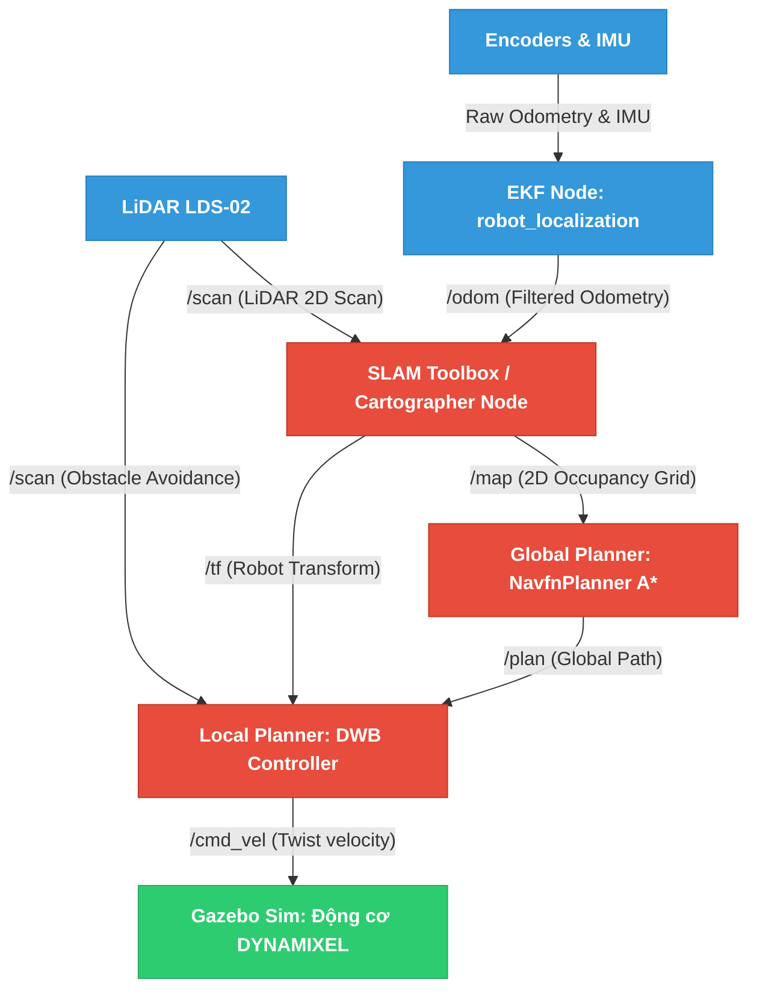

# Kiến trúc Hệ thống: Quy trình Bản đồ hóa (Mapping) và Điều hướng (Navigation) trong ROS 2

Tài liệu này trình bày toàn bộ cấu trúc hệ thống, luồng dữ liệu (Dataflow) thời gian thực và sự phối hợp giữa quy trình dựng bản đồ **SLAM (SLAM Toolbox / Cartographer)** và hệ thống điều hướng **Nav2 (NavfnPlanner A* & DWB Local Planner)** trên robot tự hành **Turtlebot3 Waffle** mô phỏng trong Gazebo.

---

## 1. Sơ đồ Kiến trúc & Luồng dữ liệu Tổng quan (System Dataflow)

Hệ thống điều hướng tự hành giải mê cung được xây dựng trên mô hình vòng lặp kín tiêu chuẩn bao gồm 4 khối chức năng: **Perception (Cảm nhận) $\rightarrow$ SLAM (Bản đồ & Định vị) $\rightarrow$ Planning (Quyết định) $\rightarrow$ Actuation (Chấp hành)**.

Dưới đây là sơ đồ luồng dữ liệu biểu diễn các Topic và Node ROS 2 phối hợp hoạt động:



---

## 2. Quy trình SLAM & Bản đồ hóa (Mapping)

Quy trình dựng bản đồ mê cung diễn ra theo trình tự tuần tự từ thu thập phần cứng đến đóng vòng lặp tối ưu:

```
[ LiDAR Scan ] + [ Filtered Odom ]
             |
             v
    [ Scan Matching ]  (So khớp tia la-zer với góc di chuyển)
             |
             v
  [ Graph Construction ]  (Dựng đồ thị tọa độ robot)
             |
             v
    [ Loop Closure ]  (Đóng vòng lặp khử trôi bản đồ)
             |
             v
   [ Occupancy Grid ]  (Xuất bản đồ lưới 2D /map)
```

1.  **Thu thập dữ liệu đầu vào:** Cảm biến **LiDAR LDS-02** quét 360 độ xung quanh với tần số cao, gửi danh sách khoảng cách vật cản qua topic `/scan`.
2.  **Khử trôi động học (Odometry Filtering):** Dữ liệu động cơ và cảm biến gia tốc IMU được EKF xử lý để cung cấp tư thế tương đối ổn định của robot.
3.  **So khớp quét (Scan Matching):** Thuật toán so khớp các tia Laser quét được ở thời điểm $t$ và $t-1$ để tính toán sự dịch chuyển hình học của robot trong không gian.
4.  **Tối ưu hóa vòng lặp (Loop Closure):** Khi robot quay trở lại một vị trí đã từng đi qua trong mê cung, hệ thống tự động nhận diện vùng không gian quen thuộc, thực hiện tối ưu đồ thị (Pose Graph Optimization) để kéo thẳng toàn bộ bản đồ và loại bỏ sai số trôi tích lũy.
5.  **Xuất bản đồ Lưới chiếm dụng (Occupancy Grid Map):** Bản đồ cuối cùng được xuất bản dưới dạng mảng 2D lên topic `/map`. Mỗi ô lưới đại diện cho một không gian kích thước thực tế (ví dụ: $5cm \times 5cm$) với ba trạng thái:
    *   **$0$ (Free Space):** Vùng trống robot có thể đi qua.
    *   **$100$ (Occupied Space):** Vật cản cố định (tường mê cung).
    *   **$-1$ (Unknown):** Vùng tối chưa quét tới.

---

## 3. Quy trình Điều hướng (Navigation Workflow)

Hệ thống điều hướng sử dụng kiến trúc phân tầng của **Nav2** để phân tách nhiệm vụ tính toán lộ trình toàn cục và điều khiển bám đường cục bộ.

### 3.1. Bản đồ chi phí (Costmaps) và Lớp Phình (Inflation Layer)
Trước khi tìm đường, bản đồ lưới tĩnh `/map` được đưa vào bộ lọc Costmap để tính toán khoảng cách an toàn:
*   **Obstacle Layer:** Dựng trực tiếp các vách tường mê cung từ `/map` và `/scan`.
*   **Inflation Layer (Lớp phình):** Tự động tạo ra một vùng chi phí giảm dần bao quanh các bức tường (dựa trên tham số `inflation_radius: 0.55`). Càng sát tường chi phí di chuyển càng cao. Điều này đảm bảo thuật toán tìm đường tránh xa tường, tránh việc robot bị cọ sát vào tường do sai số vật lý.

### 3.2. Tiến trình Điều hướng Vòng lặp kín (Closed-Loop)
Khi người dùng đặt điểm đích từ **RViz** (Topic `/goal_pose` được nạp qua `maze_solver.py`):

1.  **NavfnPlanner (Global Path Planning):**
    *   Dựng đồ thị từ Costmap.
    *   Thực hiện thuật toán **A\*** (được kích hoạt bởi cờ `use_astar: true`) tìm kiếm chuỗi ô có tổng chi phí $F(n) = G(n) + H(n)$ nhỏ nhất từ vị trí hiện tại đến lối thoát mê cung.
    *   Xuất bản đường đi tối ưu dưới dạng danh sách tọa độ hình học lên topic `/plan`.
2.  **DWB Controller (Local Path Control):**
    *   Nhận đường đi mẫu `/plan` và dữ liệu quét LiDAR tức thời `/scan`.
    *   Thực hiện thuật toán DWB liên tục ở tần số `10.0Hz` (chu kỳ 0.1s) để sinh mẫu các cặp vận tốc ($v, \omega$) khả thi động học.
    *   Sử dụng hệ thống chấm điểm **Critics** (`BaseObstacle`, `PathAlign`, `GoalAlign`, v.v.) để chọn ra quỹ đạo cua tối ưu nhất bám theo đường đi `/plan` mà không đâm vào các góc tường.
    *   Gửi lệnh `/cmd_vel` (`geometry_msgs/msg/Twist`) điều khiển tốc độ góc và tốc độ thẳng trực tiếp đến các bánh xe của Turtlebot3 Waffle.

---

## 4. Bản đồ đặc tả ROS 2 Topics của Dự án

Dưới đây là bảng tra cứu nhanh toàn bộ các chủ đề dữ liệu (Topics) được sử dụng để liên kết quy trình SLAM và Điều hướng trong đồ án của bạn:

| Tên Topic | Kiểu dữ liệu (Message Type) | Node Phát (Publisher) | Node Nhận (Subscriber) | Ý nghĩa chức năng |
| :--- | :--- | :--- | :--- | :--- |
| `/scan` | `sensor_msgs/msg/LaserScan` | LiDAR (Gazebo) | SLAM, Nav2 | Dữ liệu khoảng cách quét chướng ngại vật của mê cung. |
| `/odom` | `nav_msgs/msg/Odometry` | EKF Node | SLAM | Vị trí ước lượng tương đối dựa trên động cơ và IMU. |
| `/map` | `nav_msgs/msg/OccupancyGrid` | SLAM Node | Nav2 Planner, RViz | Bản đồ lưới mê cung 2D (0: trống, 100: tường, -1: tối). |
| `/initialpose` | `geometry_msgs/msg/PoseWithCovarianceStamped` | `maze_solver.py` / RViz | AMCL / SLAM | Thiết lập tọa độ khởi xuất phát mặc định cho robot. |
| `/goal_pose` | `geometry_msgs/msg/PoseStamped` | RViz (Nav2 Goal) | Nav2 Planner | Thiết lập điểm đích muốn robot chạy tới. |
| `/plan` | `nav_msgs/msg/Path` | Nav2 Global Planner (A*) | Nav2 Local Planner | Quỹ đạo tối ưu toàn cục giải mê cung do A* vạch ra. |
| `/cmd_vel` | `geometry_msgs/msg/Twist` | Nav2 Local Planner (DWB) | Gazebo Robot | Lệnh tốc độ di chuyển bánh xe ($v, \omega$) gửi tới robot. |

